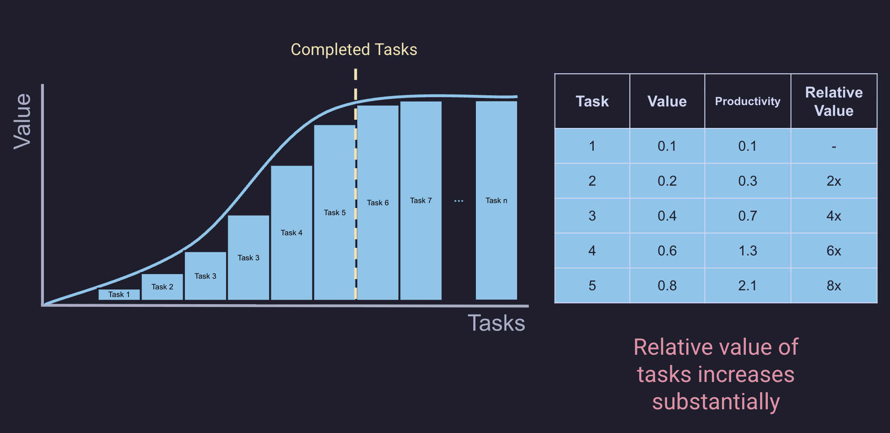
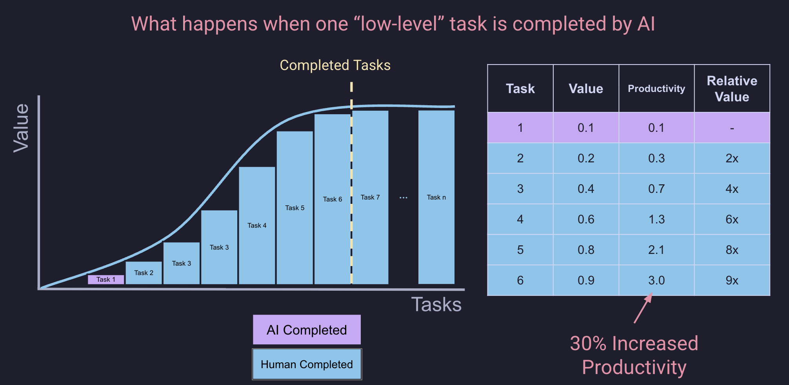

I have been trying to figure out a good mental model for thinking about how we actually get things done and where AI fits in. Here's what I've come up with.

Productivity is a completion of tasks with some value. If I compare going for a 30 min walk to going for a 30 min run, both took the same amount of time, but I was much more productive if I went for a run. Walking is a lower value task than running.

If you were to plot tasks vs value, I think you might see something like a [sigmoid](https://en.wikipedia.org/wiki/Sigmoid_function), a.k.a 'S-shaped curve'. The area under this curve up to the amount of completed tasks is the Realized Productivity.

If you then break this into discrete tasks, you start to see how each completed task contributed to the overall Productivity. Note that the value of each task is just made up and is of arbitrary units. It's really just about their relative value.

This model gets us to a point where you can start to see where AI fits in. If you consider that you start to use AI to complete tasks, that allows you to either a) complete a more valuable task or b) complete fewer tasks while still achieving the same level of productivity.

For example, it might look like this if you were to have AI complete task 1, but you maintained your level of effort, then you can complete task 6.

By having AI handle task 1, you freed up resources to complete task 6 instead. This isn't just a simple 1-for-1 swap—task 6 is significantly more valuable, contributing 30% more to your total productivity than task 1 would have.

Very quickly you can start to see that by just allocating a few tasks towards a goal to AI, you free up you own resources (time, energy, etc.) to focus on more valuable tasks. This is an important concept when you consider how best to use AI, and more importantly why you have to use AI to be the most successful going forward!
